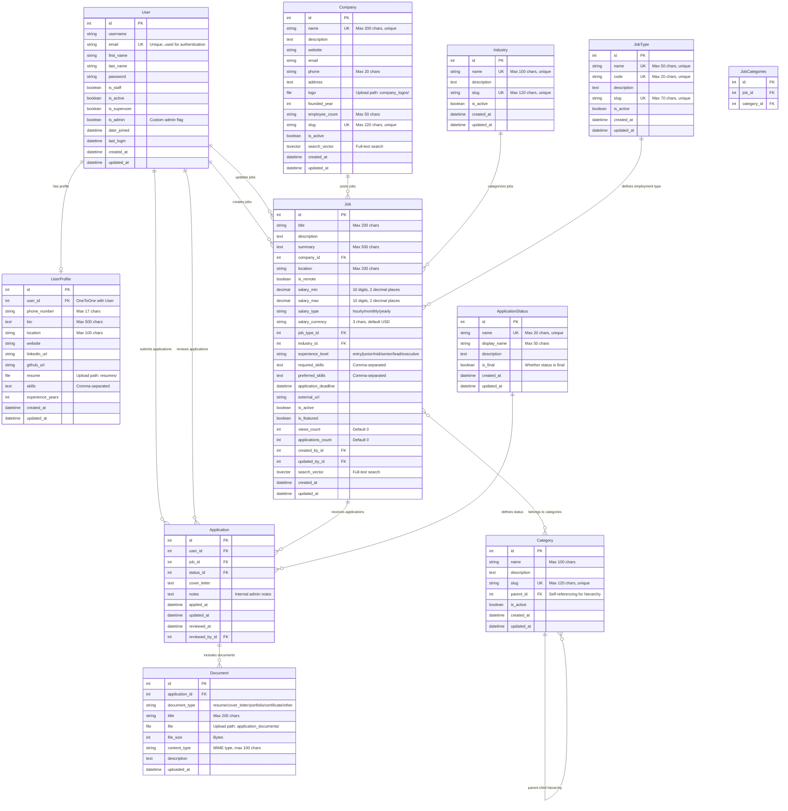

# Job Board Backend Database - Entity Relationship Diagram

## Database Schema Overview

This ERD represents the complete database structure for the Job Board Backend application, showing all entities, their attributes, and relationships.

## Key Database Features

### 1. **User Management**
- **User**: Extended Django's AbstractUser with email authentication
- **UserProfile**: One-to-one relationship with User for additional profile data
- Supports both regular users and admin users

### 2. **Company & Job Management**
- **Company**: Stores employer information with full-text search capability
- **Job**: Comprehensive job posting model with salary ranges, skills, and metadata
- **Many-to-Many**: Jobs can belong to multiple categories

### 3. **Hierarchical Classification**
- **Industry**: Flat structure for industry classification
- **JobType**: Employment type classification (full-time, part-time, etc.)
- **Category**: Hierarchical structure supporting up to 3 levels deep

### 4. **Application Workflow**
- **ApplicationStatus**: Configurable status types (pending, reviewed, accepted, etc.)
- **Application**: Links users to jobs with status tracking
- **Document**: File attachments for applications (resumes, portfolios, etc.)

### 5. **Search & Performance**
- Full-text search vectors on Company and Job models
- Strategic database indexes for common query patterns
- Optimized for filtering by location, industry, job type, and status

### 6. **Data Integrity**
- Unique constraints prevent duplicate applications
- Foreign key relationships maintain referential integrity
- Validation prevents circular references in category hierarchy
- Soft deletes through is_active flags

### 7. **Audit Trail**
- Created/updated timestamps on all major entities
- User tracking for job creation and updates
- Application review tracking with reviewer information

## Database Tables Summary

| Table | Purpose | Key Features |
|-------|---------|--------------|
| `auth_user` | User authentication | Email-based login, admin flags |
| `user_profile` | Extended user data | Skills, experience, contact info |
| `company` | Employer information | Full-text search, slug URLs |
| `industry` | Industry classification | Flat structure, active/inactive |
| `job_type` | Employment types | Standardized codes |
| `category` | Job categories | Hierarchical, max 3 levels |
| `job` | Job postings | Rich metadata, search vectors |
| `job_categories` | Job-Category mapping | Many-to-many relationship |
| `application_status` | Status definitions | Configurable workflow states |
| `application` | Job applications | User-job linking, status tracking |
| `application_document` | File attachments | Resume, portfolio uploads |

## Relationships Summary

- **One-to-One**: User ↔ UserProfile
- **One-to-Many**: Company → Jobs, Industry → Jobs, JobType → Jobs, User → Applications, Job → Applications
- **Many-to-Many**: Job ↔ Categories
- **Self-Referencing**: Category → Category (parent-child)
- **Polymorphic**: User can be both job creator and applicant

This ERD provides a comprehensive view of the job board database structure, supporting all major features including job posting, application management, user profiles, and hierarchical categorization.